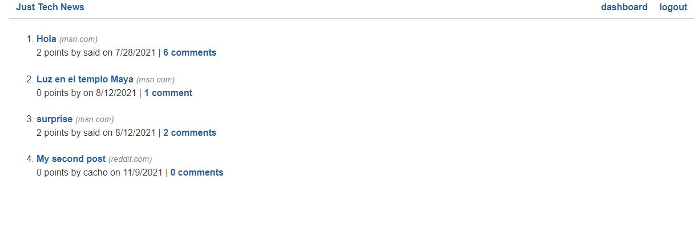

# just-tech-news

<!-- PROJECT TITE -->
  <h1 align="center">Tech Blog</h1>
  
  <!-- DESCRIPTION -->
  

  A simple blog site built with JavaScript, using Express.js, handlebars, MySQL for the database, Sqeualize, dotenv and TDD with Jest.

  The user can login/signup to an account, and that account allows the user to create new posts, leave comments, reviews, and upvote or downvote a post

  <!-- DEPLOYED LINK -->
  GitHub repository URL: https://github.com/SaidHadad/just-tech-news

  <!-- TABLE OF CONTENTS -->
  

  
Table of Contents

  <ol>
  <li><a href="#about-the-project">About The Project</a></li>
  <li><a href="#built-with">Built With</a></li>
  <li>
    <a href="#getting-started">Getting Started</a>
    <ul>
    <li><a href="#prerequisites">Prerequisites</a></li>
    <li><a href="#installation">Installation</a></li>
    </ul>
    </li>
  <li><a href="#contributing">Contributing</a></li>
  <li><a href="#license">License</a></li>
  <li><a href="#contact">Contact</a></li>
  </ol>
  

  
  
  <!-- ABOUT THE PROJECT -->
  ## About The Project

  You can create an account to add comments onto existing post or to add a new post!! (make sure to link a tech related article!)
   
   
  ToDo.- 
  <ul>
   <li>Create a Host for the database</li>
   <li>Deploy the app onto Heroku</li>

  

  ## Built With

  * JavaScript
  * Node.js
  * CSS
  * HTML5
  * Express.js
  * REST

  
  <!-- LICENSE -->
  
  ## License

 

[MIT License](https://choosealicense.com/licenses/mit/)  
  
  <!-- CONTACT -->
  
  ## Contact
  Name: Said David Hadad  
  Email: saiddavid.hadad@gmail.com  

  GIT: https://github.com/SaidHadad  
